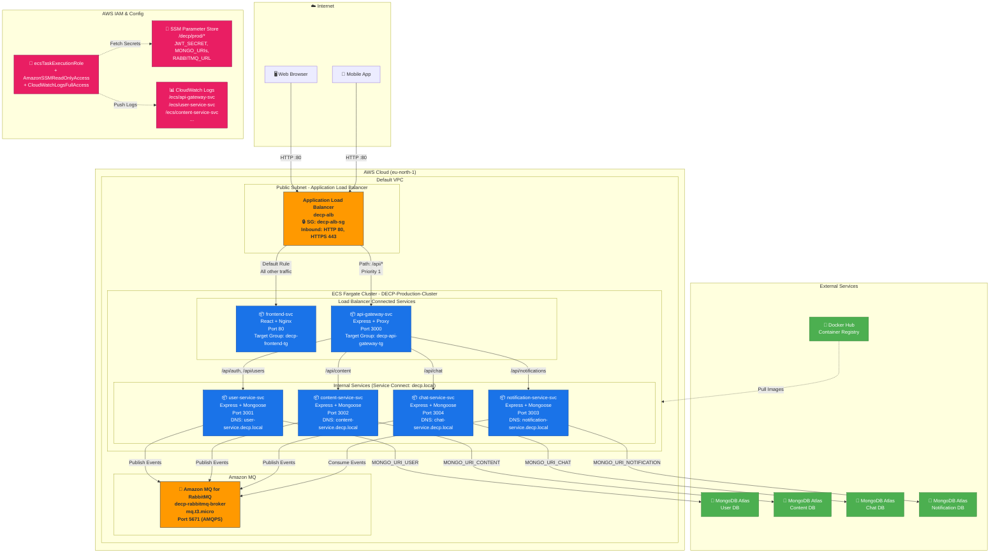
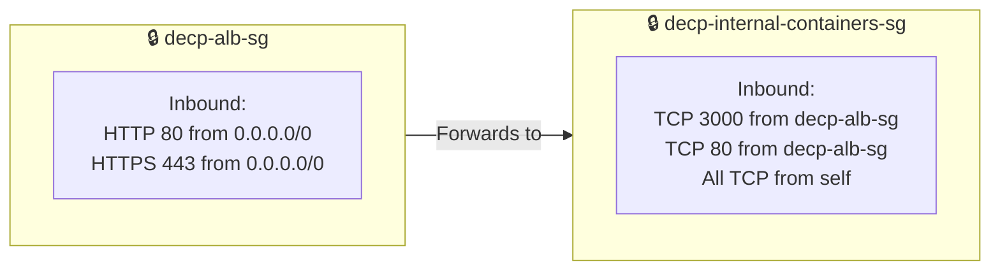
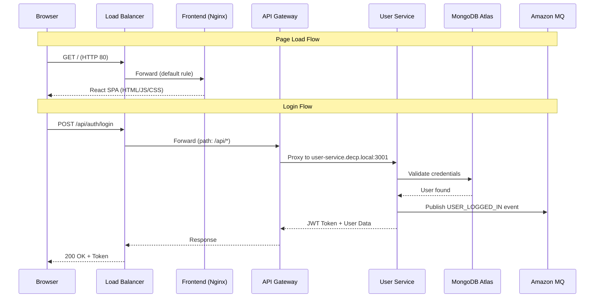

# DECP AWS Deployment Architecture

## High-Level Architecture

## Security Groups

## ALB Routing Rules

| Priority | Condition | Action | Target |
|----------|-----------|--------|--------|
| 1 | Path = `/api/*` | Forward | `decp-api-gateway-tg` (Port 3000) |
| Default | All other paths | Forward | `decp-frontend-tg` (Port 80) |

## ECS Service Connect Namespace

| Service | Discovery Name | DNS | Port |
|---------|---------------|-----|------|
| api-gateway-svc | api-gateway | api-gateway.decp.local | 3000 |
| user-service-svc | user-service | user-service.decp.local | 3001 |
| content-service-svc | content-service | content-service.decp.local | 3002 |
| notification-service-svc | notification-service | notification-service.decp.local | 3003 |
| chat-service-svc | chat-service | chat-service.decp.local | 3004 |

## SSM Parameters

| Parameter | Used By |
|-----------|---------|
| `/decp/prod/JWT_SECRET` | user-service |
| `/decp/prod/MONGO_URI_USER` | user-service |
| `/decp/prod/MONGO_URI_CONTENT` | content-service |
| `/decp/prod/MONGO_URI_CHAT` | chat-service |
| `/decp/prod/MONGO_URI_NOTIFICATION` | notification-service |
| `/decp/prod/RABBITMQ_URL` | All 4 backend services |
| `/decp/prod/JWT_EXPIRES_IN` | user-service |
| `/decp/prod/REFRESH_TOKEN_EXPIRES_IN` | user-service |

## Request Flow

